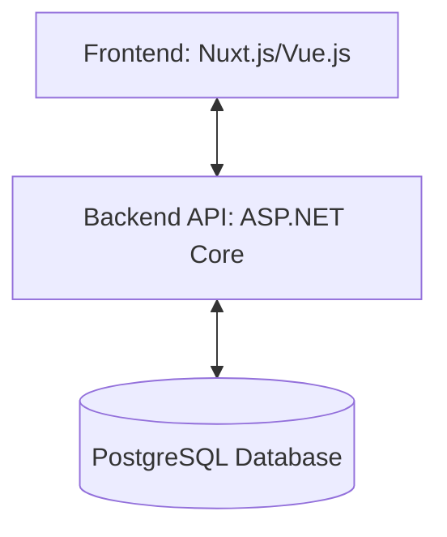
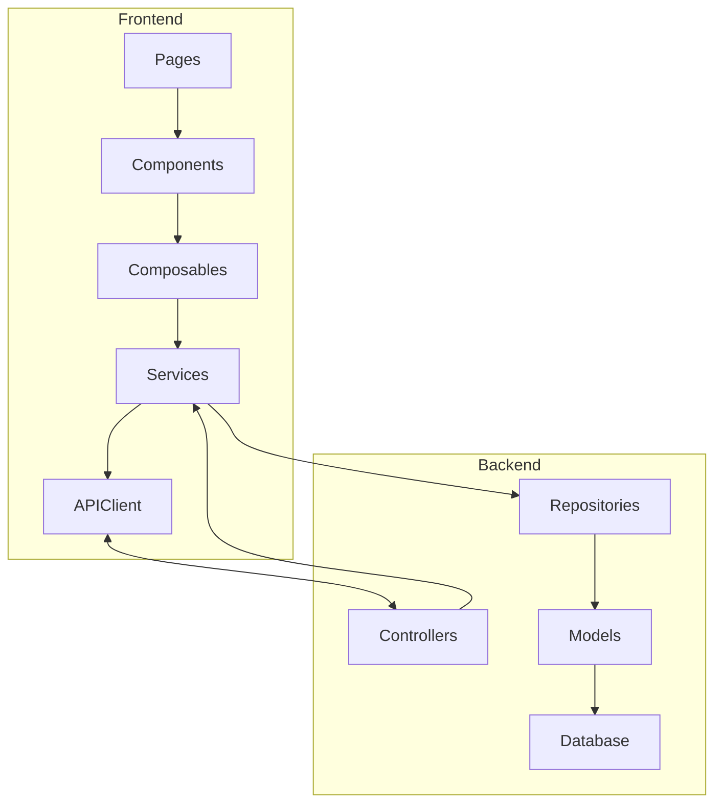

# System Patterns: Counter-Strike 2 Case Unboxer

## System Architecture

The application follows a modern client-server architecture:

-   **Frontend**: Responsible for UI rendering, animations, and user interactions
-   **Backend API**: Handles business logic, case opening calculations, and data persistence
-   **Database**: Stores case data, skin information, prices, and opening statistics

## Key Technical Decisions

### Probability System

The application uses a tiered probability system matching CS2's actual odds:

1. First determining the rarity tier (rare: 79.92%, mythical: 15.98%, etc.)
2. Then selecting a random skin within that rarity tier
3. Finally determining the wear category with appropriate distribution

### Animation Mechanism

The case opening animation uses:

-   A sliding carousel of items that stops at a predetermined position
-   A magnifying glass effect to highlight the won item
-   Transition timing functions to create authentic deceleration
-   Audio feedback timed to the visual elements

### Data Persistence

-   Skin/case data stored in structured database tables with relationships
-   User opening statistics tracked for analytics purposes
-   Price data captured for inventory valuation

## Design Patterns

### Frontend

-   **Component-Based Architecture**: UI elements decomposed into reusable Vue components
-   **State Management**: Centralized state for application configuration and inventory
-   **Composable Functions**: Reusable logic extracted into Vue composables
-   **Responsive Design**: Layout adapts to different screen sizes

### Backend

-   **Repository Pattern**: Data access abstracted through repositories
-   **Service Layer**: Business logic encapsulated in service classes
-   **Model-View-Controller**: Separation of concerns between data, presentation, and control
-   **Data Transfer Objects**: Clear separation between internal models and API contracts

## Component Relationships

The frontend components communicate with each other through props and events, while the backend uses dependency injection to manage service relationships.

# Ad Integration Patterns

## Component Structure

-   AdPlaceholder component for testing and development
-   Responsive classes using Tailwind
-   Mobile-first approach with md: breakpoint
-   Container-based layout with fixed max-widths

## Layout Patterns

1. Mobile Layout:

    - Top banner inside main container
    - Full-width ads
    - Simplified spacing

2. Desktop Layout:
    - Side skyscraper ads
    - Fixed positioning relative to main content
    - 1280px max-width main container
    - 1600px breakpoint for side ads

## Styling Patterns

-   Using Tailwind classes for consistency
-   Responsive visibility with block/hidden classes
-   Standard spacing units
-   Container-based max-widths
